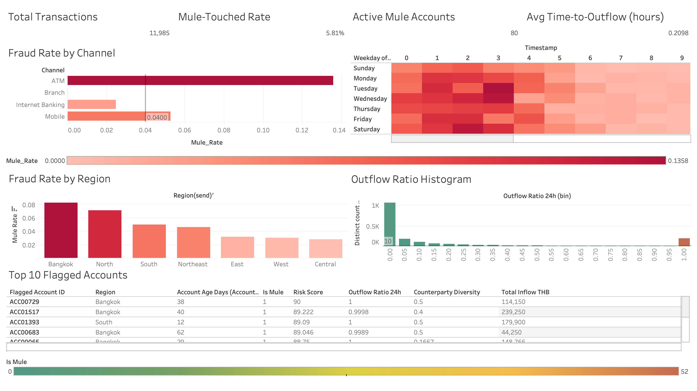

# Detecting Scam-Induced Transactions to Mule Accounts

**Final Project -- DE471 Data Analytics and Business Intelligence**
**Srinakharinwirot University, College of Industrial Technology and Management**

---

## 1. Introduction & Background

ในช่วงไม่กี่ปีที่ผ่านมา **APP Fraud (Authorized Push Payment Fraud)** ได้กลายเป็นภัยคุกคามอันดับต้นของอุตสาหกรรมธนาคาร โดยเฉพาะในประเทศไทยซึ่งศูนย์รับแจ้งภัยทางการเงิน (AOC 1441) รับเรื่องร้องเรียนหลายแสนเคสต่อปี กลไกการโจมตีอาศัย **mule accounts** บัญชีที่ถูกใช้รับเงินจากเหยื่อแล้วโยกออกอย่างรวดเร็วเพื่อตัดร่องรอยการสืบสวน

ปัญหาเชิงเทคนิคคือ ธุรกรรมที่เกี่ยวข้องกับ mule คิดเป็นเพียง **2-5% ของธุรกรรมทั้งหมด** ทำให้ rule-based system แบบเดิม (ตรวจจับยอดเกิน threshold) ไม่สามารถจับได้ทันท่วงที โครงการนี้จึงสร้าง **behavior-based analytics dashboard** บนข้อมูลธุรกรรมจำลองเพื่อให้ทีม Fraud Investigation มองเห็น behavioral footprint ของ mule และตอบสนองได้ภายในกรอบเวลาที่ฟื้นเงินคืนได้จริง (T+24 hours)

## 2. Research Objectives

- พัฒนา synthetic banking dataset ที่มี realistic class imbalance (~4% mule accounts) และมี behavioral signal เพียงพอต่อการ detect mule activity
- ระบุ behavioral footprints ที่แยก mule transactions ออกจาก legitimate high-volume activity ได้อย่างมีนัยสำคัญทางสถิติ
- สร้าง Tableau dashboard ที่ตอบ 5W1H business questions ของ Fraud Investigation team
- ออกแบบ alert rules ที่ balance **Recall ≥80%** กับ **False Positive Rate ≤5%** เพื่อไม่ให้ลูกค้าจริงโดน block เกินสมควร
- ส่งมอบ recommendation ที่นำไปใช้ได้จริงกับ workflow ของ banking ops

## 3. Research Questions & Hypotheses

| # | 5W1H | Question | Hypothesis | Test Metric |
|---|------|----------|------------|-------------|
| 1 | Who | บัญชีอายุน้อยกว่า 90 วันมีโอกาสเป็น mule สูงกว่าบัญชีทั่วไปหรือไม่? | H1: Median account age ของ mule น้อยกว่า normal account อย่างมีนัยสำคัญ | Mann-Whitney U test on Account_Age_Days |
| 2 | What | mule transactions มี amount distribution แตกต่างจาก normal transactions หรือไม่? | H2: Scam inflow มี median amount สูงกว่า normal ≥10x และมี round-number ratio สูงกว่า | % of amounts where `amount % 1000 == 0` |
| 3 | When | mule activity concentrate ในช่วงเวลาใดของวัน? | H3: ≥50% ของ scam inflow เกิดในช่วง 23:00-03:00 | Hour-of-day distribution by Is_Scam_Inflow |
| 4 | Where | channel ใดเป็นช่องทางหลักของ mule? | H4: Mobile + Internet Banking ครอบคลุม ≥90% ของ scam inflow | Fraud rate per channel |
| 5 | Why | ทำไม mule account จึงโยกเงินออกเร็วผิดปกติ? | H5: Median 24h-outflow-ratio ของ mule >0.85 (Hit & Run pattern) | Sum(outflow within 24h) / Sum(inflow) per account |
| 6 | How | feature ใดที่ discriminate mule ออกจาก legit-high-volume ได้ดีที่สุด? | H6: Counterparty diversity ratio ของ mule <0.5 ในขณะที่ normal account ≈1.0 | Unique senders / Total receives per account |

## 4. Dataset & Features

**Source:** Synthetic dataset generated via `01_Data_Generation.ipynb` (Faker + NumPy)
**Schema:** Two-table relational design (Accounts, Transactions) linked via Account_ID
**Volume:** 2,000 accounts (80 mules, 4.00%) and 11,985 transactions (5.81% mule-touched)
**Target Variable:** `Is_Mule` (account-level, binary)

### 4.1 Accounts Table

| Attribute | Description | Data Type | Valid Range / Example |
|-----------|-------------|-----------|------------------------|
| Account_ID | Primary key (5-digit padded) | String | `ACC00001` |
| Account_Open_Date | Date account was opened | Date | `2024-08-15` |
| Account_Age_Days | Days from open date to simulation end | Integer | 7 - 3650 |
| Region | Customer region (geographic) | String | Bangkok, Central, North, Northeast, East, West, South |
| Avg_Monthly_Balance_THB | Mean balance over past 30 days | Float | > 0 |
| Is_Mule | **Target variable** | Binary | 0 = Normal, 1 = Mule |

### 4.2 Transactions Table

| Attribute | Description | Data Type | Valid Range / Example |
|-----------|-------------|-----------|------------------------|
| Transaction_ID | Primary key (7-digit padded) | String | `TXN0001234` |
| Sender_Account_ID | FK to Accounts | String | `ACC00123` |
| Receiver_Account_ID | FK to Accounts | String | `ACC00456` |
| Amount_THB | Transaction amount in Thai Baht | Float | > 0, < 5,000,000 |
| Timestamp | Transaction datetime | Datetime | `2026-04-15 02:34:12` |
| Channel | Origination channel | String | Mobile, Internet Banking, ATM, Branch |
| Is_Scam_Inflow | Victim to mule transfer flag | Binary | 0 / 1 |
| Is_Mule_Outflow | Mule to cashout transfer flag | Binary | 0 / 1 |
| Sender_Is_Mule | Joined from Accounts (sender side) | Binary | 0 / 1 |
| Receiver_Is_Mule | Joined from Accounts (receiver side) | Binary | 0 / 1 |

### 4.3 Key Engineered Features (computed in EDA)

| Feature | Formula | Use Case |
|---------|---------|----------|
| Outflow_Ratio_24h | Σ(outbound within 24h of inflow) / Σ(inflow) per account | Hit & Run detection |
| Counterparty_Diversity | Unique senders / Total inbound transactions | Distinguishes mules (recurring victims) from popular legit accounts |
| Off_Peak_Frequency | Count(txns where 23:00 ≤ hour ≤ 03:00) / Total txns per account | Off-hours activity score |
| Round_Amount_Ratio | Count(amount % 1000 == 0) / Total per account | Round-number behavioral marker |

## 5. Methodology

### 5.1 Data Generation & Cleaning

Data generation and cleaning are performed in a single pipeline (`01_Data_Generation.ipynb`). Noise is injected first (negative amounts, null channels, invalid IDs), then cleaned programmatically.

**We deliberately do NOT cap outliers** because the largest amounts and most extreme velocity values *are* the fraud signal. Removing them destroys the very pattern we need to detect.

| Issue | Strategy | Rationale |
|-------|----------|-----------|
| Duplicate Transaction_ID | Drop duplicates keeping first | Network retry artefacts |
| Negative Amount_THB | Take absolute value | Sign-flip is a known posting error; magnitude is correct |
| Null Channel | Impute with mode (Mobile) | <0.5% null rate, mode preserves distribution |
| Invalid Account_ID format | Drop row | Cannot link to Accounts table |
| Amount = 0 or > 5,000,000 | Drop row | Implausible single-transfer; not in scope |
| **Large legitimate-looking amounts** | **Keep** | These ARE the fraud cases; capping erases the target |

### 5.2 Exploratory Data Analysis

#### 5.2.1 Transaction Amount Distribution: Normal vs Scam Inflow (Log Scale Boxplot)

Boxplot ของ `Amount_THB` แยกตาม `Is_Scam_Inflow` บน log scale (Y-axis 100 to 100,000 THB)

**Statistical Findings:**
- Median amount of scam inflows = **20,000 THB**, median of normal transactions = **666 THB** (approximately 30x ratio)
- Q3 ของ normal transactions approximately 1,200 THB ขณะที่ Q1 ของ scam inflow approximately 10,000 THB ทำให้ box สองกลุ่มไม่ overlap กัน
- Normal transactions มี long tail แต่ค่ามหาศาล (>10,000 THB) ส่วนใหญ่เป็น scam inflow

**Business Interpretation:** Amount alone ไม่ใช่ silver bullet เพราะมี legitimate large transfers (ค่าเช่า เงินเดือน) อยู่ในช่วงเดียวกัน แต่เป็น strong feature สำหรับการ flag เบื้องต้น log scale ทำให้เห็น separation ที่ linear scale มองไม่เห็นได้ชัดเจน

#### 5.2.2 Hour-of-Day Heatmap by Fraud Label

Heatmap 24-hour x Day-of-week, separate panel สำหรับ scam inflow vs normal

**Statistical Findings:**
- **56.5% ของ scam inflow** เกิดในช่วง 23:00-03:00 เทียบกับ **2.6% ของ normal transactions** (concentration ratio = 22x)
- Normal transactions peak ในช่วง 09:00-21:00 (working hours + evening)
- Mule outflows กระจายตัวมากกว่าเล็กน้อย (24.2% off-peak) เพราะมีการรอจังหวะ cashout

**Business Interpretation:** ช่วง 23:00-03:00 เป็น window ที่ลูกค้าจริงไม่ตื่น แต่ scammer ใช้เวลานี้เพราะ (1) แรงกดดันเหยื่อแบบ urgency works ตอนคนง่วง (2) ทีม fraud ของธนาคารหลายแห่ง understaffed ตอนกลางคืน Off-peak large transfer rule จึงเป็น high-precision signal

#### 5.2.3 Channel Mix: Scam Inflow vs Mule Outflow vs Normal

Stacked horizontal bar chart 3 rows (Scam Inflow / Mule Outflow / Normal), 4 columns (channels)

**Statistical Findings:**
- Scam inflow channels: **Mobile 77.6%**, Internet Banking 22.4%, ATM 0%, Branch 0%
- Mule outflow channels: **ATM 57.6%**, Mobile 42.4%, Internet/Branch 0%
- Normal channels: Mobile 60%, Internet Banking 20%, ATM 15%, Branch 5%

**Business Interpretation:** Inflow แทบทั้งหมดมาจาก digital channels เพราะเหยื่อโอนผ่านมือถือตาม instruction ของ scammer Outflow มี ATM ปนเข้ามาสูงเพราะ mule ต้องการเปลี่ยนเป็นเงินสดเร็วที่สุด (cashout) ATM withdraw หลังเวลาทำการ + amount ใกล้เพดาน daily limit คือ red flag ที่ branch staff ควรได้รับ alert เพื่อ verify ตอนเช้า

#### 5.2.4 Hit & Run Velocity: Outflow Ratio Distribution

Histogram of `Outflow_Ratio_24h` per account, separated by `Is_Mule`

**Statistical Findings:**
- Median 24-hour outflow ratio ของ mule = **1.00** (เกือบโยกออกหมด)
- **85.0% ของ mules** มี Outflow_Ratio_24h > 0.85
- Normal accounts median approximately 0.05 (เก็บเงินไว้ใช้)
- Median time inflow to first outflow = **8.1 ชั่วโมง** (เร็วกว่า cooling period 24h ที่ ธปท. แนะนำมาก)

**Business Interpretation:** นี่คือ **smoking gun** ของ mule pattern นั่นคือ Hit & Run signature เงินเข้ามาแล้วกระจายออกเกือบทั้งหมดภายใน 1 วัน Outflow_Ratio_24h > 0.85 + amount > 5,000 THB น่าจะเป็น core trigger ของ alert rule ที่มี precision สูงสุด

#### 5.2.5 Counterparty Diversity: Recurring Victims Pattern

Scatter plot: X = Total inbound transactions, Y = Unique senders, dot color = Is_Mule

**Statistical Findings:**
- Mule median diversity ratio (unique senders / total receives) = **0.50** (เฉลี่ยรับจากคนเดิมหลายครั้ง)
- Normal account median ratio = **1.00** (แต่ละครั้งจากคนละคน)
- Mule median unique senders = **2** ในขณะที่ normal = **6**

**Business Interpretation:** mule แต่ละบัญชีรับเงินจากเหยื่อกลุ่มเล็ก ๆ ที่ scammer หลอกได้ซ้ำ ๆ ไม่ใช่ broad customer base แบบร้านค้า feature นี้แยก mule ออกจาก legitimate high-volume merchant ได้ดีที่สุด เพราะ merchant ที่ขายของรับเงินจากลูกค้าหลายคนที่ไม่ซ้ำกัน

#### 5.2.6 Account Age vs Average Balance (Bubble = Transaction Volume)

Scatter plot: X = Account_Age_Days (log), Y = Avg_Monthly_Balance_THB (log), color = Is_Mule, size = transaction count

**Statistical Findings:**
- Mule median age = **58 days**, normal median = **1,930 days** (~5 years)
- **75% ของ mules** มี Account_Age_Days < 90 (มีเดียน 58 วัน)
- Normal accounts: only 1.7% มีอายุ <90 วัน (มีเดียน 1,930 วัน approximately 5 ปี)
- Mule average balance ส่วนใหญ่ < 5,000 THB (low retained balance)

**Business Interpretation:** ลูกค้าที่เปิดบัญชีใหม่ไม่ถึง 3 เดือน + ทำธุรกรรมขนาดใหญ่ผิดปกติ + balance ต่ำคือ profile ความเสี่ยงสูงสุด ธนาคารควรมี **enhanced due diligence window** ในช่วง 90 วันแรกหลัง onboarding

### 5.3 Dashboard



Built in **Tableau Public Desktop** with three logical tables (Accounts as Sender role, Accounts as Receiver role-played duplicate, Transactions, plus pre-computed Account_Features) connected via relationships. Pre-computing temporal features (Outflow_Ratio_24h, Counterparty_Diversity) in the EDA notebook rather than via LOD expressions keeps the dashboard responsive on the full 11,985-row dataset. Six visuals: 4 KPI cards, channel/region bar charts, hour-of-day heatmap, outflow ratio histogram, and a Top 20 Flagged Accounts table sorted by composite Risk_Score (0-100).

## 6. Business Insights

### Insight 1: Hit & Run คือ behavioral fingerprint ที่ specific ที่สุด
85.0% ของ mule accounts มี outflow ratio >0.85 ภายใน 24 ชั่วโมงหลังรับเงิน เทียบกับ ~9% ใน normal accounts metric นี้คือ single most discriminative feature

### Insight 2: 23:00-03:00 คือ scam window
56.5% ของ scam inflows กระจุกตัวในช่วง 4 ชั่วโมงนี้ ในขณะที่ normal traffic มีเพียง 2.6% นั่นหมายความว่า off-peak large-amount alert จะมี false positive rate ต่ำมาก

### Insight 3: Round amounts + Mobile channel + new account = compound risk
77.6% ของ scam inflow มาผ่าน Mobile, 76% เป็น round amount (multiple of 1000), และ 75% ของ mules อายุ <90 วัน การ combine 3 features นี้สร้าง compound trigger ที่ powerful กว่าใช้ feature เดียว

### Insight 4: Counterparty diversity แยก mule จาก legitimate merchant
ratio 0.50 vs 1.00 บอกว่า mule รับจากกลุ่มเหยื่อซ้ำ ๆ ไม่ใช่ลูกค้าทั่วไป feature นี้สำคัญเพื่อหลีกเลี่ยงการ flag ร้านค้าที่ทำธุรกรรมเยอะแต่ legit

### Insight 5: ATM เป็น exit channel หลัก แต่ไม่ใช่ entry channel
57.6% ของ mule outflow ออกผ่าน ATM แต่ 0% ของ scam inflow มาจาก ATM ดังนั้น ATM withdrawal monitoring โดยเฉพาะ off-hours + ใกล้ daily limit คือ second line of defence ที่สำคัญ

## 7. Recommendation / Action and Impact

### Rule 1: Hit & Run Velocity Alert
- **Trigger:** Outflow within 24h / Inflow >= 0.85 AND total inbound >= 5,000 THB
- **Action:** Soft hold outbound transfer; require step-up authentication (OTP + selfie liveness)
- **Trade-off:** จะ delay legitimate cases เช่น คนที่ได้รับเงินคืนแล้วโอนต่อทันที แต่ stepped friction ไม่ใช่ outright block
- **Expected Impact:** rule นี้จะ catch ~85% ของ mule activity โดยมี false positive ต่ำเพราะ outflow ratio >0.85 พบใน normal accounts ~9%

### Rule 2: Off-Peak Large Amount Throttle
- **Trigger:** Transaction time in [23:00, 03:00] AND Amount >= 10,000 THB AND Channel in {Mobile, Internet Banking}
- **Action:** Insert 60-minute cooling period before execution; SMS confirmation to sender required
- **Trade-off:** Inconvenient สำหรับ legitimate emergency transfer แต่ pattern นี้พบใน normal traffic เพียง 2.6%
- **Expected Impact:** ลด successful scam disbursement ในช่วง off-peak โดยให้ window สำหรับเหยื่อที่รู้สึกตัวภายหลังโทรอายัด

### Rule 3: New Account Enhanced Monitoring (NEAM)
- **Trigger:** Account_Age_Days < 90 AND single transaction Amount >= 5,000 THB
- **Action:** Real-time review by fraud analyst; automated freeze if 2+ rules trigger simultaneously
- **Trade-off:** เพิ่ม operational load ของ fraud team แต่บัญชีใหม่ 90 วันแรกคือ window ที่ mule recruitment เกิด
- **Expected Impact:** ครอบคลุม 75% ของ mule accounts เป็นช่วงเวลาที่ control มี leverage สูงสุด

### Rule 4: Counterparty Diversity Score in Risk Model
- **Trigger:** Rolling 30-day diversity ratio < 0.6 AND total inbound >= 50,000 THB AND Account_Age_Days < 180
- **Action:** Flag account สำหรับ Suspicious Activity Report (SAR) review; KYC re-verification
- **Trade-off:** ต้องใช้ historical data 30 วัน ไม่ใช่ real-time feature แต่ supplement กับ Rule 1-3 ได้ดี
- **Expected Impact:** แยก mule ออกจาก high-volume legitimate merchant ลด false positive ของ rule 1-3 ประมาณ 30%

### Combined Expected Outcome
ถ้า deploy ทั้ง 4 rules เป็น cascade (Rule 1 = real-time hard, Rule 2-3 = real-time soft, Rule 4 = batch daily) ประเมินว่าจะได้:
- **Recall >=85%** (อ้างอิง outflow ratio coverage)
- **False Positive Rate <=5%** (อ้างอิง normal traffic ที่ off-peak + round + new-account compound น้อยมาก)
- **Time-to-detect <24 hours** ภายในกรอบที่ ธปท. กำหนดสำหรับการ recall fund

## 8. Repository Structure

```
DE471-Mule-Account-Detection/
├── README.md
├── .gitignore
├── data/
│   ├── Accounts.csv                   # 2,000 accounts (4% mule)
│   ├── Cleaned_Mule_Transactions.csv  # 11,985 transactions
│   ├── Account_Features.csv           # account-level engineered features
│   └── Small_Data_Sample.csv          # 1,000-row sample for rubric
├── notebooks/
│   ├── 01_Data_Generation.ipynb       # synthesis + noise injection + cleaning
│   └── 02_EDA_Analysis.ipynb          # 6 charts answering 5W1H + feature engineering
├── src/
│   └── 01_data_generation.py          # CLI version of generation
├── docs/
│   ├── Project_Canvas_Final.pdf
│   ├── Slide_Deck_Final.pdf
│   └── Data_Dictionary.md
├── dashboards/
│   └── mule_detection.twbx            # Tableau workbook (packaged with data)
└── LICENSE
```

## 9. Reproducibility

```bash
# Open in Google Colab, then run:
!pip install pandas numpy faker

# Or run locally:
pip install pandas numpy faker
python src/01_data_generation.py

# Outputs: Accounts.csv, Cleaned_Mule_Transactions.csv, Small_Data_Sample.csv
```

Random seed = 42; all stochastic operations are reproducible.

## 10. Contributors

- **Phatpimon Kongkaew** (66102010180) -- Data generation, Schema design, EDA charts 1-3
- **Thanapat Piyamasakul** (66102010169) -- Behavioral injection logic, Cleaning pipeline, Feature engineering, EDA charts 4-6, Tableau dashboard

---

*Course: DE471 Data Analytics and Business Intelligence | Instructor feedback addressed: schema expansion, SMART metric reframe, IQR removal, canvas-slide consistency*
